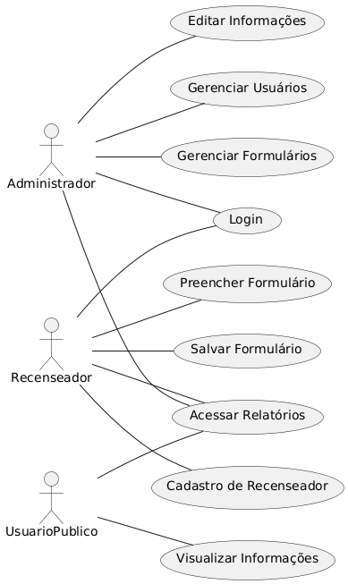

# Casos de Uso

Os **casos de uso** são representações dos principais fluxos de interação entre os usuários do sistema e suas funcionalidades. Eles ajudam a entender melhor os requisitos e garantem que todos os atores envolvidos consigam atingir seus objetivos dentro da aplicação.

## 📌 Descrição dos Atores

- **Recenseador** 📝  
  Responsável por preencher os formulários com informações coletadas sobre os moradores. Após salvar os dados, ele não pode editá-los.

- **Administrador** 🔧  
  Possui acesso total ao sistema, podendo gerenciar formulários, editar informações e administrar usuários cadastrados.

- **Usuário Público** 👥  
  Pode visualizar as informações disponíveis no sistema, garantindo transparência dos dados coletados.

## 📊 Funcionalidades Principais

- **Cadastro e Login:** Controle de acesso dos usuários ao sistema.  
- **Preenchimento de Formulários:** O recenseador insere dados coletados no sistema.  
- **Edição de Informações:** O administrador pode corrigir ou atualizar dados.  
- **Visualização Pública:** Usuários podem acessar informações relevantes sem edição.  
- **Geração de Relatórios:** Todos os atores podem visualizar relatórios consolidados.  

## 🎯 Diagrama de Casos de Uso

Abaixo está o diagrama representando as interações entre os atores e as funcionalidades do sistema:

---

Este diagrama fornece uma visão clara do funcionamento do sistema, garantindo que todos os requisitos estejam bem definidos e compreendidos.