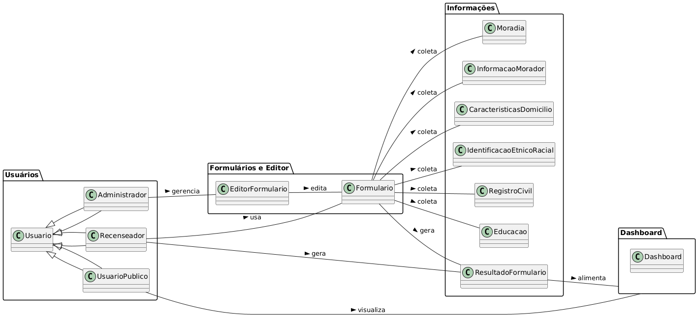

# Não precisa entregar para a AP1
## Introdução

O diagrama de classes UML é um diagrama que mostra a estrutura do sistema desenhado no nível de classes e interfaces, ilustra as funcionalidades, dependências e relacionamentos de cada elemento. Pode ser vista como uma representação visual da arquitetura de um sistema. 

## Metodologia

A equipe se reuniu por .... e realizou um brainstorm onde foram dicutidos os tópicos chaves e a arquitetura geral dos sistemas, e assim criamos...

Para a criação da primeira versão do diagrama de classes, a equipe utilizou o programa... Além disso, foi utilizado... para videoconferência e Visual Studio Code / Live Share para elaboração da documentação.

# ENTREGUE NO PRÓXIMO INCREMENTO
## Diagrama de Classes

### Versão 1.0

Este diagrama oferece uma visão clara e organizada da arquitetura de classes, tornando compreensível a interação entre diferentes componentes do sistema e suas responsabilidades.

